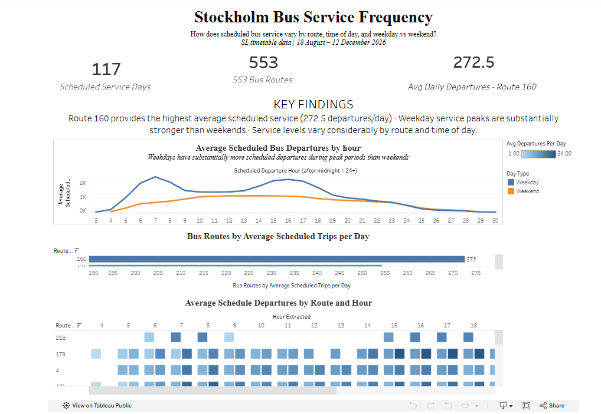

# stockholm-bus-service-analysis
SQL and Tableau analysis of scheduled Stockholm bus service frequency by route, time of day, and weekday vs weekend.

## Project Overview

**Project type:** SQL + Tableau portfolio project

**Data:** SL GTFS scheduled timetable data

**Tools:** Google BigQuery, SQL, Tableau

**Focus:** Bus service frequency by route, hour, and weekday/weekend

## Introduction

This project analyses scheduled Stockholm bus service using SL timetable data for the service period from 18 August to 12 December 2026.

The analysis investigates how scheduled bus service varies by route, time of day, and weekday versus weekend.

The project uses SQL in Google BigQuery for data exploration and analysis, with Tableau used to create the final dashboard.

## Business Question

**How does scheduled Stockholm bus service frequency vary by route, time of day, and weekday versus weekend?**

## Key Findings

### 1. Highest overall service

Route 160 had the highest average number of scheduled trips per operating day, at approximately 272 trips per day during the timetable period.

### 2. Service varies by hour

Scheduled bus departures varied considerably throughout the day. High-frequency routes did not maintain the same level of service during every hour, with differences between peak and off-peak periods.

### 3. Weekday service is stronger

Scheduled bus service was substantially higher on weekdays than weekends, particularly during morning and afternoon periods.
This pattern may be consistent with higher expected travel demand during typical weekday commuter periods, although passenger demand was not analysed in this project.

### 4. Routes can have different service patterns

Bus routes did not necessarily operate with the same pattern throughout the week. For example, Route 827 operated on weekdays but not weekends, while UL805 showed differences in operating hours and scheduled frequency between weekdays and weekends.

## Objectives

The analysis aims to:

- Identify which Stockholm bus routes provide the highest level of scheduled service.
- Examine how scheduled bus departures vary throughout the day.
- Compare scheduled bus service between weekdays and weekends.
- Investigate how operating days and service patterns differ between individual routes.

 ## Tableau Dashboard

 [View the interactive Tableau dashboard →](https://public.tableau.com/app/profile/david.archer4886/viz/SLbusschedule/Dashboard1)

The Tableau dashboard provides two complementary views of scheduled bus service.

The bar chart ranks the top 15 routes by average scheduled trips per operating day, showing which routes have the highest overall scheduled service.

The heatmap shows how scheduled departures are distributed across hours of the day, with weekday and weekend patterns shown separately.

Together, the visualizations show how scheduled bus service varies by route, time of day and day type.

## Data

This project uses SL GTFS timetable data for Stockholm public transport, covering the service period from 18 August to 12 December 2026.

The dataset contains additional GTFS tables, including `agency`, `attributions`, `booking_rules`, `feed_info`, `shapes` and `transfers`. These were explored as part of understanding the dataset but were not required for the analysis.

The analysis focuses on bus services and uses the following GTFS tables:

- `routes` — contains route information such as route number, route name and transport type.
- `trips` — contains scheduled trip patterns and their associated service IDs.
- `stop_times` — contains scheduled arrival and departure times for each stop on a trip.
- `stops` — contains information about stops, including stop names.
- `calendar_dates` — contains the dates on which each service ID operates.

## Data Selection

The data was selected because it provides scheduled timetable information that can be used to investigate bus service levels across routes, times of day and different days of the week.

I first explored the available public transport data to understand the different transport modes and table relationships. Bus services were then identified using the GTFS `route_type` value for bus services (`700`).

## Tools & Skills

- **SQL / Google BigQuery** — data exploration, joins, aggregation and transformation
- **Tableau** — dashboard development and data visualization
- **GTFS data** — working with relational timetable data
- **Data analysis** — KPI development, time-based analysis and weekday/weekend comparisons
- **Data communication** — presenting findings, assumptions and limitations
- **GitHub** — project documentation and version-controlled SQL files

## Data Preparation & Methodology

The analysis involved several steps to prepare the GTFS timetable data and create consistent measures of scheduled bus service.

### Identifying bus services

The `routes` table was used to identify bus services using `route_type = 700`, as the dataset contains multiple public transport modes. Route IDs were then linked to the `trips` table to identify the scheduled trips associated with each bus route.

### Expanding scheduled trips across service dates

GTFS trips are associated with a `service_id` rather than an individual date. The `calendar_dates` table was joined to `trips` using `service_id` to identify the dates on which each scheduled trip operates.

This means that trip counts after this join represent **scheduled trip occurrences**, rather than unique trip definitions.

Using the actual service dates also allows the analysis to account for differences in operating days between routes and to classify service as weekday or weekend.

### Measuring scheduled departures

The first stop of each trip (`stop_sequence = 1`) was used as the reference point for identifying the scheduled departure time.

This provides a consistent starting point for comparing when scheduled trips begin across routes and dates. Using all stops would count the same trip multiple times as it travels along its route and would therefore not provide a valid measure of route-level departures.

This approach measures **route-level scheduled departures**, rather than the frequency of buses available at individual stops.

### Weekday and weekend classification

The weekday/weekend classification was derived from the actual service date in `calendar_dates`.

Dates were classified as:

- **Weekday** — Monday to Friday
- **Weekend** — Saturday and Sunday

The Monday–Sunday fields in the `calendar` table were checked but did not contain active service records in this dataset. I therefore used `calendar_dates`, which provides the actual dates associated with each service ID, and classified these dates based on the day of the week.

### Handling timetable times

Scheduled departure times were stored as text. The hour component was extracted and converted to a numeric value so departures could be grouped into hourly time periods.

GTFS allows times to extend beyond 24:00:00. For example, `27:52:00` represents 03:52 on the following calendar day, while remaining associated with the service day that began the previous day.

These extended times were retained so that overnight services remained associated with their original GTFS service day.

### Measuring service frequency

Service frequency was measured using the **average number of scheduled departures per operating day**.

This measure was chosen instead of total scheduled departures because routes do not necessarily operate on the same number of days. Dividing scheduled trip occurrences by the number of operating dates provides a more comparable measure of typical daily scheduled service between routes.

For the hourly analysis, an **implied headway** was calculated by dividing 60 minutes by the average number of scheduled departures within each hour.

This provides an intuitive way to interpret hourly service levels. For example, an average of 4 scheduled departures per hour corresponds to an implied headway of approximately 15 minutes.

The implied headway is a calculated average rather than the actual interval between consecutive buses. Calculating actual scheduled intervals would require comparing each individual departure time with the next departure. This was outside the scope of this analysis, which focuses on overall scheduled service levels by hour.

## SQL Analysis

SQL was used in Google BigQuery to explore the dataset, prepare the data and calculate the measures used in the analysis.

### 1. Identifying bus services

Bus routes were identified using the GTFS `route_type` value of `700`.
This was the first step in narrowing the dataset to the bus services relevant to the business question.

[View SQL query](sql/identify_bus_routes.sql)

### 2. Calculating scheduled service by route

The `routes`, `trips` and `calendar_dates` tables were joined to calculate the total number of scheduled trip occurrences, operating days and average scheduled trips per operating day for each bus route.
This addresses the first part of the business question by identifying which routes provide the highest overall level of scheduled service.

[View SQL query](sql/service_by_route.sql)

### 3. Calculating hourly scheduled service

The first stop of each trip (stop_sequence = 1) was used to identify the scheduled departure time. The departure hour was then extracted so scheduled service could be compared across different times of day.
This addresses the time-of-day part of the business question by showing how scheduled service varies throughout the day for each route.

[View SQL query](sql/hourly_service.sql)

### 4. Comparing weekday and weekend service

The service date was classified as either a weekday or weekend. This allowed scheduled departures to be compared by hour and day type.
This directly addresses the weekday versus weekend part of the business question and shows whether scheduled service levels change depending on the day type.

[View SQL query](sql/weekday_weekend_service.sql)

## Data Limitations

- This analysis uses scheduled timetable data rather than real-time or historical vehicle movement data. It therefore measures planned service rather than actual service delivered.
- Scheduled departures do not indicate whether buses actually operated on time, were delayed, or were cancelled.
- The analysis uses the first stop of each trip as the reference departure point and therefore measures route-level scheduled service rather than service frequency experienced at individual stops.
- The implied headway is based on average hourly departures and should not be interpreted as the actual interval between consecutive buses.
- The analysis covers the timetable period from 18 August to 12 December 2026 and may not represent service patterns outside this period.
- Route-level comparisons measure scheduled service volume rather than route importance, passenger demand, or service quality.

